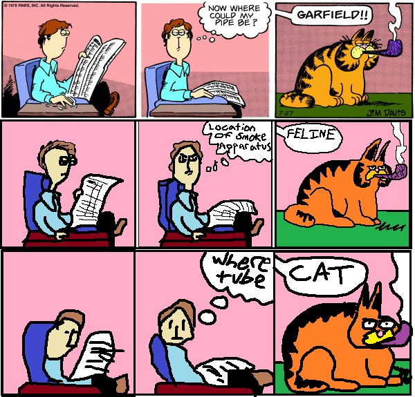

where-tube
==========



Experiments in YouTube misery.

## Dependencies

* `zbarimg`
* `convert`
* `qrencode`
* `ffmpeg`

## Usage

### Single QR per frame

```bash
$ cd single
```

#### Encoding

```bash
$ ./file2qr < input
$ ./frames2mp4 output.mp4
```

#### Decoding

```bash
$ dir=output_dir ./mp42frames input.mp4
$ qr2file output_dir/*.png > output
```

### Multiple QRs per frame ("mosaic")

```bash
$ cd multi
```

#### Encoding

```bash
$ ./encode output.mp4 < input
```

#### Decoding (WIP)

```bash
$ ./decode input.mp4 > output
```
